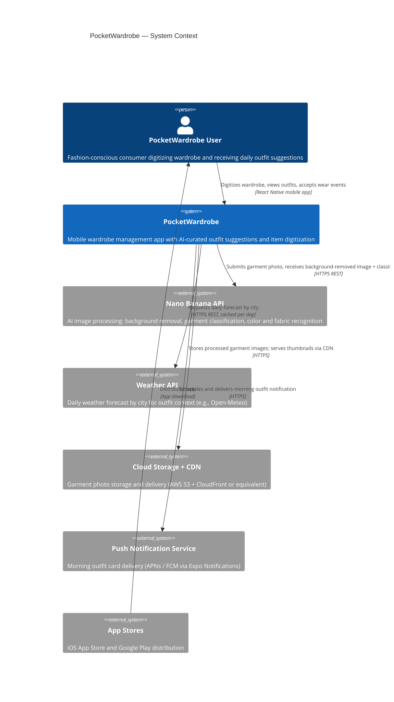
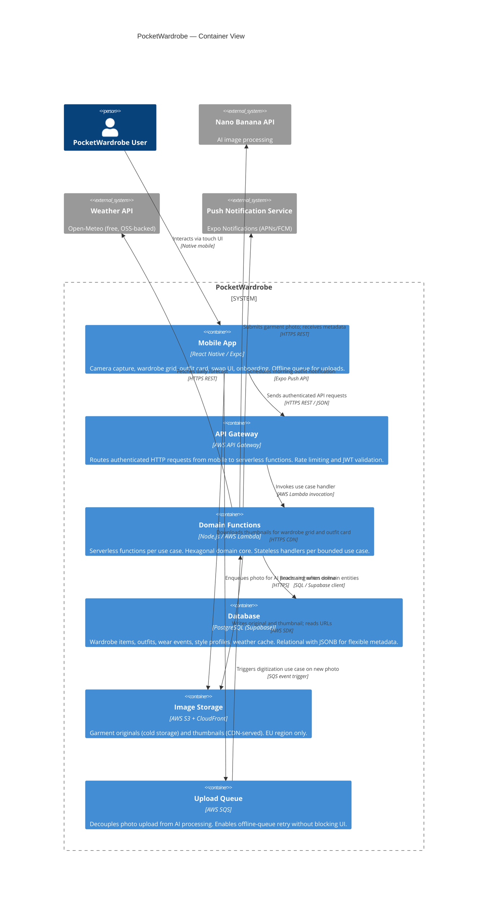
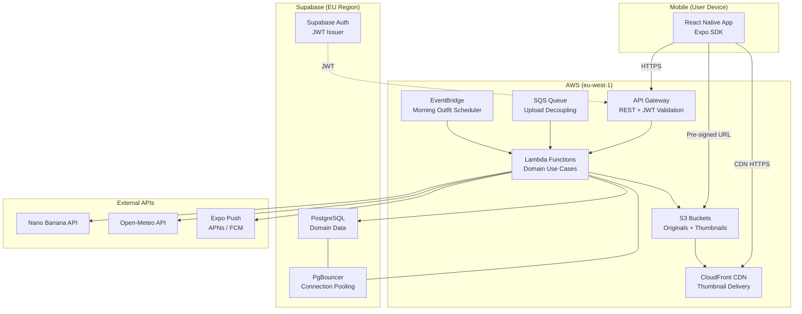

# PocketWardrobe — Architecture Design

**Version**: 1.0
**Date**: 2026-02-28
**Status**: Design wave complete — ready for DISTILL wave handoff
**Paradigm**: OOP (TypeScript) — see ADR-006

---

## 1. System Overview

PocketWardrobe is a mobile-first wardrobe management system. Users digitize physical garments via camera, receive AI-curated daily outfit suggestions contextualised by weather and occasion, and track wear history to surface underutilised items.

### Core Value Loop

```
Digitize item → AI extracts metadata → Wardrobe populated →
Outfit engine suggests → User accepts/swaps → Wear event logged →
Unworn items surfaced → Repeat
```

### Walking Skeleton Boundaries (MVP)

- Style calibration and style profile persistence
- Camera-based item digitization with AI metadata extraction (Nano Banana API)
- Wardrobe grid with 5-item unlock gate and progress indicator
- Weather + occasion-aware daily outfit suggestion with 7-day rotation constraint
- Item swap within outfit suggestion
- Unworn item awareness (15-item, 7-day eligibility gate)

### Deferred (architecture seams defined, not implemented)

- Virtual Try-On (AI photorealistic rendering on user body)
- Resale Listing Generator (Vinted/Depop export)
- Smart Shopping / Gap Detection (affiliate referrals)
- Social Closet & Influencer Feed

---

## 2. Architectural Approach

**Pattern**: Hexagonal Architecture (Ports and Adapters)
**Rationale**: See ADR-001

Key principles applied:
- Domain core has zero dependencies on infrastructure or frameworks
- All external systems (Nano Banana, weather API, database, CDN, push notifications) are accessed through outbound ports
- All external triggers (HTTP handlers, mobile events, scheduled triggers) enter through inbound ports
- Dependencies point inward exclusively — adapters depend on domain; domain depends on nothing external

---

## 3. C4 System Context Diagram (L1)



---

## 4. C4 Container Diagram (L2)



---

## 5. C4 Component Diagram (L3) — Domain Functions

The Domain Functions container has 5+ internal components warranting a component view.

```mermaid
C4Component
  title Domain Functions — Component View (Hexagonal Core)

  Container_Boundary(domainFunctions, "Domain Functions") {

    Component(wardrobeCore, "Wardrobe Domain", "TypeScript module", "Pure domain entities: Item, Wardrobe, Outfit, StyleProfile, WearEvent. No framework dependencies.")

    Component(digitizationUC, "DigitizeItem Use Case", "Inbound port handler", "Receives photo + user context. Orchestrates: EXIF strip → face check → AI submission → metadata review → item persist.")
    Component(outfitUC, "GenerateOutfitSuggestion Use Case", "Inbound port handler", "Reads wardrobe + style profile + weather context. Applies rotation constraint. Returns ranked outfit candidates.")
    Component(wearEventUC, "RecordWearEvent Use Case", "Inbound port handler", "Creates WearEvent from accepted outfit (with any swaps applied). Updates worn_count.")
    Component(styleProfileUC, "UpdateStyleProfile Use Case", "Inbound port handler", "Creates or updates StyleProfile. Applies defaults on skip.")
    Component(unwornItemsUC, "GetUnwornItems Use Case", "Inbound port handler", "Derives unworn stats at query time. Applies eligibility gate (15 items, 7 days).")

    Component(itemRepo, "Item Repository Port + Adapter", "Outbound port + Supabase adapter", "CRUD for item_records. Adapter maps DB rows to domain entities.")
    Component(outfitRepo, "Outfit Repository Port + Adapter", "Outbound port + Supabase adapter", "Persists outfit_suggestions and outfit_history.")
    Component(wearEventRepo, "WearEvent Repository Port + Adapter", "Outbound port + Supabase adapter", "Persists wear_events; supports worn_count derivation query.")
    Component(styleProfileRepo, "StyleProfile Repository Port + Adapter", "Outbound port + Supabase adapter", "Reads and writes StyleProfile. Initializes defaults.")
    Component(aiProcessorPort, "AI Processor Port + Nano Banana Adapter", "Outbound port + HTTP adapter", "Submits photo. Returns background-removed URL + classification metadata. Circuit breaker applied.")
    Component(weatherPort, "Weather Service Port + Open-Meteo Adapter", "Outbound port + HTTP adapter", "Fetches daily forecast. Caches result per day/city. Returns null on failure (graceful degradation).")
    Component(imageStorePort, "Image Store Port + S3 Adapter", "Outbound port + AWS SDK adapter", "Writes original and thumbnail; returns CDN URLs. Strips EXIF metadata before write.")
    Component(pushPort, "Push Notification Port + Expo Adapter", "Outbound port + Expo adapter", "Schedules morning outfit notification.")
  }

  Rel(digitizationUC, wardrobeCore, "Creates Item aggregate")
  Rel(outfitUC, wardrobeCore, "Reads Wardrobe, StyleProfile; creates Outfit")
  Rel(wearEventUC, wardrobeCore, "Creates WearEvent from accepted Outfit")
  Rel(styleProfileUC, wardrobeCore, "Creates or updates StyleProfile")
  Rel(unwornItemsUC, wardrobeCore, "Derives WardrobeStats")

  Rel(digitizationUC, aiProcessorPort, "Delegates AI processing")
  Rel(digitizationUC, imageStorePort, "Delegates image persistence")
  Rel(digitizationUC, itemRepo, "Persists confirmed Item")
  Rel(outfitUC, weatherPort, "Fetches weather context")
  Rel(outfitUC, outfitRepo, "Reads outfit_history for rotation check")
  Rel(outfitUC, outfitRepo, "Persists generated outfit_suggestion")
  Rel(outfitUC, itemRepo, "Reads wardrobe items")
  Rel(wearEventUC, wearEventRepo, "Persists WearEvent")
  Rel(styleProfileUC, styleProfileRepo, "Reads and writes StyleProfile")
  Rel(unwornItemsUC, wearEventRepo, "Queries wear events for unworn calculation")
  Rel(unwornItemsUC, itemRepo, "Reads all items for eligibility check")
```



---

## 6. Hexagonal Architecture — Dependency Rules

```
┌─────────────────────────────────────────┐
│              ADAPTERS (outer)           │
│  HTTP handlers | DB repos | API clients │
│  Camera adapter | CDN adapter           │
│                                         │
│  ┌───────────────────────────────────┐  │
│  │          PORTS (boundary)         │  │
│  │  Inbound: Use case interfaces     │  │
│  │  Outbound: Repository interfaces  │  │
│  │           Service interfaces      │  │
│  │                                   │  │
│  │  ┌─────────────────────────────┐  │  │
│  │  │       DOMAIN CORE           │  │  │
│  │  │  Entities + Value Objects   │  │  │
│  │  │  Domain Rules               │  │  │
│  │  │  Use Case Logic             │  │  │
│  │  │                             │  │  │
│  │  │  NO external imports        │  │  │
│  │  └─────────────────────────────┘  │  │
│  └───────────────────────────────────┘  │
└─────────────────────────────────────────┘
```

**Dependency rules** (strictly enforced):
- Domain core imports: nothing outside itself
- Use cases import: domain entities + outbound port interfaces (never adapters)
- Adapters import: port interfaces they implement + external libraries
- Mobile app: imports inbound port interfaces (invokes use cases via API)

**Seam points for deferred features**:

| Deferred Feature | Seam Location | Port to Add |
|-----------------|---------------|-------------|
| Virtual Try-On | `DigitizeItem` use case | `TryOnRenderingPort` (outbound, Nano Banana photorealistic render endpoint) |
| Resale Listing | Item aggregate | `ListingExportPort` (outbound, Vinted/Depop adapter) |
| Gap Detection | `GenerateOutfitSuggestion` use case | `GapAnalysisPort` (inbound use case) + `ShoppingPartnerPort` (outbound) |
| Social Closet | New bounded context | `SocialClosetPort` (separate module, anti-corruption layer from core) |

---

## 7. Integration Patterns

### 7.1 Nano Banana AI Integration

- **Pattern**: Async processing via SQS queue
- **Flow**: Mobile uploads photo to S3 → enqueues SQS message → Lambda consumer submits to Nano Banana → stores result → notifies mobile via WebSocket or polling
- **Latency target**: < 10s P95 (TT-01 spike validates this)
- **Fallback**: If Nano Banana times out, item enters "pending review" state; user is not blocked
- **Resilience**: Circuit breaker on Nano Banana HTTP adapter; exponential backoff on retry
- **Cold start**: Lambda functions kept warm with provisioned concurrency for digitization path

### 7.2 Weather API Integration

- **Provider**: Open-Meteo (free, OSS-backed, no API key required for basic forecast)
- **Pattern**: Cache-aside, TTL = midnight local time per user city
- **Storage**: Weather cache in PostgreSQL (`weather_cache` table, city + date key)
- **Fallback**: Weather service port returns `null`; outfit use case proceeds without weather context; UI displays "Weather unavailable"
- **Privacy**: Location stored at city-level only (not GPS coordinates per requirements)

### 7.3 Image Upload and CDN Delivery

- **Upload path**: Mobile → S3 pre-signed URL upload → SQS trigger → Lambda processing
- **Storage tiers**:
  - Original: S3 Standard-IA (cold storage, EU region)
  - Thumbnail (200KB max): S3 + CloudFront CDN
- **EXIF stripping**: Performed in Lambda before S3 write (Sharp library)
- **Face detection**: Rekognition or lightweight on-device check before AI submission; blocks upload if face detected, prompts user
- **CDN cache**: Thumbnails immutable (content-addressed); long TTL

### 7.4 API Rate Limiting

- API Gateway usage plan: per-user rate limit 10 req/s, burst limit 50 req/s
- Morning outfit generation (EventBridge): staggered invocation across a 30-minute jitter window (07:00–07:30 local time) to avoid simultaneous Lambda burst
- SQS AI processing queue: Dead Letter Queue (DLQ) configured after 3 failed processing attempts; CloudWatch alarm on DLQ depth > 0; CTO-owned alert for failed digitization jobs

### 7.5 Push Notifications

- **Provider**: Expo Notifications (abstracts APNs + FCM; MIT license)
- **Pattern**: Scheduled Lambda (EventBridge rule, 07:00 local time per user timezone)
- **Content**: Pre-computed outfit card from previous evening's generation
- **Consent**: Notification permission requested after 5-item unlock (user has seen value)

### 7.6 Offline Handling (Mobile)

- **Wardrobe browsing**: React Query with persistence to device storage (fully offline)
- **Photo capture**: Captured photos and confirmed metadata stored locally (React Native MMKV or Async Storage)
- **Upload queue**: Retry on reconnect using Expo's network state listener; idempotent upload with deduplication key per photo hash

---

## 8. Quality Attribute Strategies

### Performance
- Outfit generation: < 3s — enforced by indexing `item_records` on `(user_id, occasion_tags, season)` and computing rotation check against `outfit_history` with a 7-day window index
- AI processing: < 10s P95 — validated by TT-01 spike; async path with SQS prevents UI blocking
- App cold start: < 2s — React Native with Expo Go + lazy loading for non-critical screens
- Grid render (200 items): < 1.5s — FlashList (Shopify) with thumbnail CDN URLs

### Reliability
- Core wardrobe + outfit: 99.5% uptime — AWS Lambda + API Gateway SLA
- Graceful degradation: Weather API failure → outfit without weather; AI failure → item in pending state
- Offline wardrobe: React Query persistence; photo upload queue with retry

### Security and GDPR
- JWT authentication via Supabase Auth (short-lived access tokens + refresh tokens)
- All data EU-region only (Supabase EU region + S3 eu-west-1)
- Photo consent: logged server-side with timestamp and consent version before first upload
- EXIF stripped before storage
- Account deletion: cascading delete of all user data within 30 seconds (BR enforced by database cascades + Lambda cleanup)
- Body data (Phase 3 Try-On): explicit second consent event required; separate `body_profile` table with independent deletion

### Scalability
- Serverless auto-scales to 4,445 MAU without architectural change
- Database connection pooling via Supabase's PgBouncer (built-in)
- AI processing volume scales via SQS queue depth (Lambda concurrency auto-scales)

### Maintainability
- Hexagonal architecture isolates domain from infrastructure — swap any adapter without touching domain
- Supabase migrations via CLI (versioned schema changes)
- OpenTelemetry instrumentation on all Lambda handlers for distributed tracing

### Observability
- AI correction rate tracked per category (operational dashboard, CTO-owned)
- Outfit suggestion acceptance rate tracked per user (feeds A/B testing)
- Lambda execution duration + error rate via CloudWatch
- Cold start frequency monitored; provisioned concurrency added if > 5% of invocations are cold

---

## 9. Deployment Architecture



---

## 10. ADR Index

| ADR | Decision |
|-----|---------|
| ADR-001 | Hexagonal architecture selection |
| ADR-002 | Mobile framework: React Native + Expo |
| ADR-003 | Backend runtime and serverless platform: Node.js + AWS Lambda |
| ADR-004 | Database: PostgreSQL via Supabase |
| ADR-005 | AI integration strategy: Nano Banana + SQS async |
| ADR-006 | Development paradigm: OOP TypeScript |
