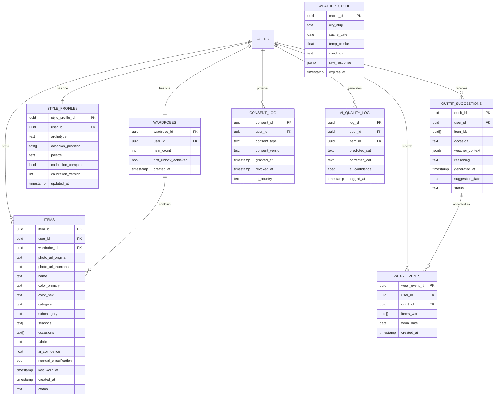

# PocketWardrobe — Data Models

**Version**: 1.0
**Date**: 2026-02-28
**Database**: PostgreSQL 16 (via Supabase, EU region)

Domain model and persistence model are kept close — PostgreSQL's JSONB handles flexible metadata without requiring a separate document store.

---

## 1. Core Domain Entities

### Item

```
Item {
  item_id:              UUID (PK)
  user_id:              UUID (FK → auth.users)
  wardrobe_id:          UUID (FK → wardrobes)

  // Photo
  photo_url_original:   string   // S3 original (cold storage)
  photo_url_thumbnail:  string   // CloudFront CDN thumbnail

  // AI-extracted metadata
  name:                 string   // AI-generated or user-entered
  color_primary:        string   // e.g., "Camel / Warm tan"
  color_hex:            string?  // optional hex
  category:             string   // e.g., "Outerwear"
  subcategory:          string   // e.g., "Coat"
  seasons:              string[] // ["spring", "autumn", "winter"]
  occasions:            string[] // ["work", "casual"]
  fabric:               string?  // AI-detected if supported

  // Classification provenance
  ai_confidence:        float?   // 0.0-1.0
  manual_classification: boolean // true if user corrected AI

  // Wear tracking (derived on query; worn_count is computed)
  last_worn_at:         timestamp?
  created_at:           timestamp
  updated_at:           timestamp

  // Lifecycle
  status:               "active" | "pending_ai" | "pending_review" | "deleted"
}
```

**Indexes**:
- `(user_id, status)` — wardrobe grid query
- `(user_id, occasions, seasons, status)` — outfit engine filter
- `(user_id, last_worn_at)` — unworn items query

---

### Wardrobe

One wardrobe per user (1:1). The wardrobe is created automatically on first user registration.

```
Wardrobe {
  wardrobe_id:           UUID (PK)
  user_id:               UUID (FK → auth.users, UNIQUE)
  item_count:            int  // maintained by DB trigger on items INSERT/DELETE
  first_unlock_achieved: boolean  // one-time flag for celebration animation
  created_at:            timestamp
  updated_at:            timestamp
}
```

**Note**: `item_count` is maintained by a PostgreSQL trigger on `items` to ensure consistency. The trigger fires on INSERT (status = "active") and on UPDATE (status transition to "deleted"). This avoids count divergence from concurrent item additions.

---

### StyleProfile

```
StyleProfile {
  style_profile_id:     UUID (PK)
  user_id:              UUID (FK → auth.users, UNIQUE)

  archetype:            string   // "classic" | "minimalist" | "bold" | "sporty" | "romantic"
  occasion_priorities:  string[] // ordered, e.g., ["work", "casual"]
  palette:              string   // "neutral" | "vibrant" | "monochrome" | "earthy"

  calibration_completed: boolean
  calibration_version:   int     // increments on each update; used by suggestion engine cache

  created_at:           timestamp
  updated_at:           timestamp
}
```

**Default values on skip** (BR-09):
- `archetype = "classic"`
- `occasion_priorities = ["work", "casual"]`
- `palette = "neutral"`
- `calibration_completed = false`

---

### OutfitSuggestion

Immutable after creation (BR-05 adjacent). User acceptance creates a `WearEvent`.

```
OutfitSuggestion {
  outfit_id:            UUID (PK)
  user_id:              UUID (FK → auth.users)

  item_ids:             UUID[]   // ordered: outerwear → top → bottom → footwear → accessory
  occasion:             string   // occasion this outfit targets
  weather_context:      JSONB?   // { city, date, tempCelsius, condition } or null
  reasoning:            string   // 1-2 sentence explanation shown in UI

  generated_at:         timestamp
  suggestion_date:      date     // the date this outfit was suggested for (not necessarily today)

  status:               "active" | "invalidated"  // invalidated when a referenced item is deleted (BR-08)
}
```

**Indexes**:
- `(user_id, suggestion_date DESC)` — daily outfit and rotation check
- `(user_id, status, suggestion_date)` — rotation constraint query (7-day window)

---

### WearEvent

```
WearEvent {
  wear_event_id:        UUID (PK)
  user_id:              UUID (FK → auth.users)
  outfit_id:            UUID (FK → outfit_suggestions)  // the original suggestion

  items_worn:           UUID[]   // final items worn (may differ from outfit.item_ids after swap)
  worn_date:            date     // the date the outfit was worn

  created_at:           timestamp  // timestamp of acceptance (not necessarily same as worn_date)
}
```

**Derived queries**:
- `worn_count` per item: `SELECT COUNT(*) FROM wear_events WHERE worn_date >= NOW() - 30d AND item_id = ANY(items_worn)`
- `last_worn_at` per item: `SELECT MAX(worn_date) FROM wear_events WHERE item_id = ANY(items_worn)`

**Note**: `worn_count` and `last_worn_at` are derived at query time — not stored on `items`. This avoids update contention and ensures consistency with `WearEvent` as the single source of truth.

---

## 2. Value Object — Persistence Mapping

Value objects are stored as columns or JSONB within the entity they belong to. No separate tables for value objects.

| Value Object | Storage |
|-------------|---------|
| `Color` | `color_primary TEXT, color_hex TEXT` columns on `items` |
| `Category` | `category TEXT, subcategory TEXT` columns on `items` |
| `Season` | `seasons TEXT[]` column on `items` |
| `Occasion` | `occasions TEXT[]` column on `items`; `occasion_priorities TEXT[]` on `style_profiles` |
| `WeatherContext` | `weather_context JSONB` column on `outfit_suggestions` |
| `AIClassification` | Transient — not persisted; result mapped to Item fields on confirm |
| `WardrobeStats` | Derived at query time — never persisted |

---

## 3. Image Metadata Schema

Images are stored in S3 with metadata tracked in the `items` table. No separate image metadata table.

```
Item.photo_url_original:   s3://pocket-wardrobe-prod/{user_id}/{item_id}/original.jpg
Item.photo_url_thumbnail:  https://cdn.pocketwardrobe.com/{user_id}/{item_id}/thumb.webp
```

**Constraints**:
- Original: JPEG or HEIC, up to 10MB before compression, 2MB max after compression
- Thumbnail: WebP, max 200KB, generated by Sharp in Lambda
- EXIF: Stripped in Lambda before any storage write (GDPR)
- Face detection: Performed before AI submission; upload blocked if face detected

**S3 object naming**: Content-addressed using `{user_id}/{item_id}/{version}` ensures immutability and prevents cache poisoning.

---

## 4. Supporting Tables

### `weather_cache`

```
weather_cache {
  cache_id:     UUID (PK)
  city_slug:    string   // lowercase, e.g., "milan"
  cache_date:   date
  temp_celsius: float
  condition:    string   // e.g., "partly_cloudy"
  raw_response: JSONB    // full API response
  fetched_at:   timestamp
  expires_at:   timestamp  // set to midnight local time of city
}
```

**Index**: `(city_slug, cache_date)` UNIQUE

---

### `consent_log`

```
consent_log {
  consent_id:       UUID (PK)
  user_id:          UUID (FK → auth.users)
  consent_type:     string   // "photo_storage" | "body_data" (Phase 3)
  consent_version:  string   // e.g., "v1.2" (tracks which privacy policy version was accepted)
  granted_at:       timestamp
  revoked_at:       timestamp?  // null if still active
  ip_country:       string?   // for jurisdiction tracking (country code only)
}
```

**Retention**: NOT deleted on account delete (regulatory requirement — 3 years minimum).

---

### `ai_quality_log`

```
ai_quality_log {
  log_id:           UUID (PK)
  user_id:          UUID (FK → auth.users)
  item_id:          UUID (FK → items)
  predicted_cat:    string   // AI prediction
  corrected_cat:    string?  // user correction (null if no correction)
  ai_confidence:    float
  logged_at:        timestamp
}
```

**Operational use**: Aggregated by category to detect correction rate > 25% threshold (BR-10 and monitoring requirement from requirements.md Section 4).

---

## 5. Full Schema Diagram



---

## 6. GDPR Compliance Summary

### Data Inventory

| Data Type | Classification | Basis | Retention | Deletion on Request |
|-----------|---------------|-------|-----------|-------------------|
| Garment photos | Personal data | Explicit consent (GDPR Art. 7) | User lifetime | Yes — cascade + S3 cleanup |
| Style preferences | Personal data | Contract performance | User lifetime | Yes — cascade |
| Wear history | Personal data | Contract performance | User lifetime | Yes — cascade |
| Consent logs | Legal compliance record | Legal obligation | 3 years minimum | NO — regulatory hold |
| AI quality logs | Pseudonymised | Legitimate interest | 2 years | Anonymised, not deleted |
| Weather cache | Non-personal | N/A | 24 hours | Auto-expires |
| Analytics | Anonymised aggregate | Legitimate interest | Indefinite | Not personal data |

### Consent Model

1. **Photo consent**: Required before first upload. Logged in `consent_log` with version. Revocable from Settings > Privacy.
2. **Body data consent** (Phase 3): Separate consent event required for Virtual Try-On body profile. Independent table, independent deletion.

### User Deletion (GDPR Article 17)

Cascade delete within 30 seconds:
1. Supabase Auth user deletion triggers database cascade (FK constraints)
2. Lambda post-delete hook: deletes S3 objects for `{user_id}/**`
3. `consent_log` rows flagged as `user_deleted = true` but retained (regulatory)
4. `ai_quality_log` rows anonymised (user_id set to null, item_id cleared)

### Location Privacy

City-level location only (not GPS coordinates). Stored as city name string. No latitude/longitude persisted.

### EXIF Stripping

EXIF metadata removed from all photos in Lambda before S3 write. Includes: GPS coordinates, device identifiers, capture timestamp.
